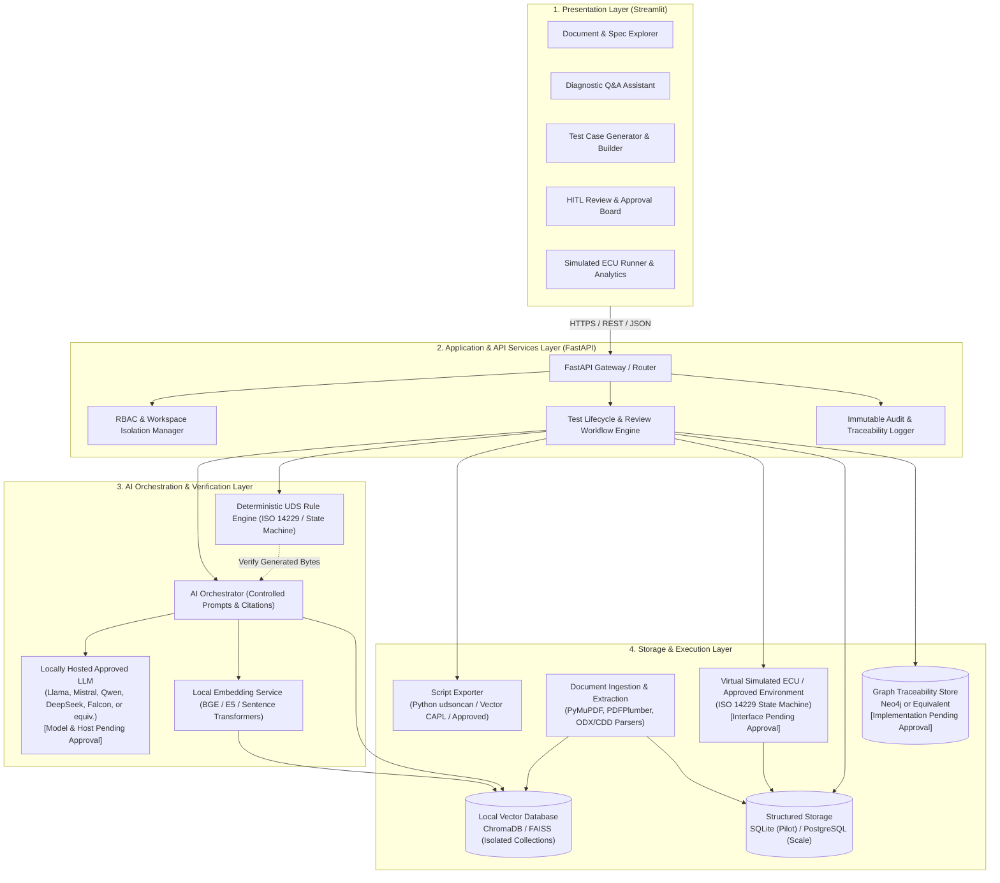
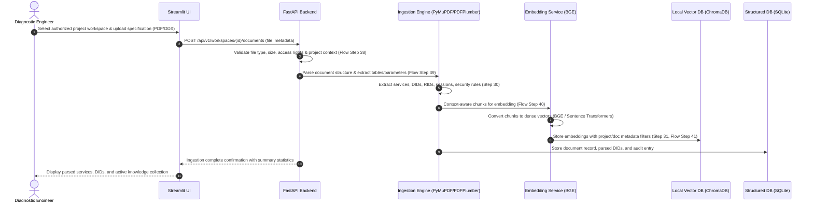
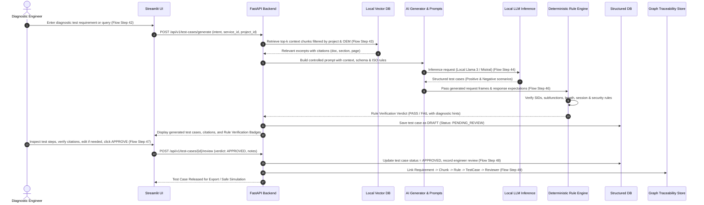
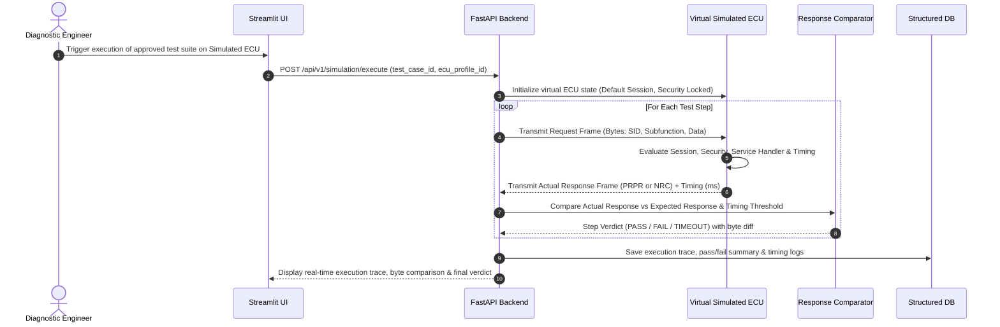
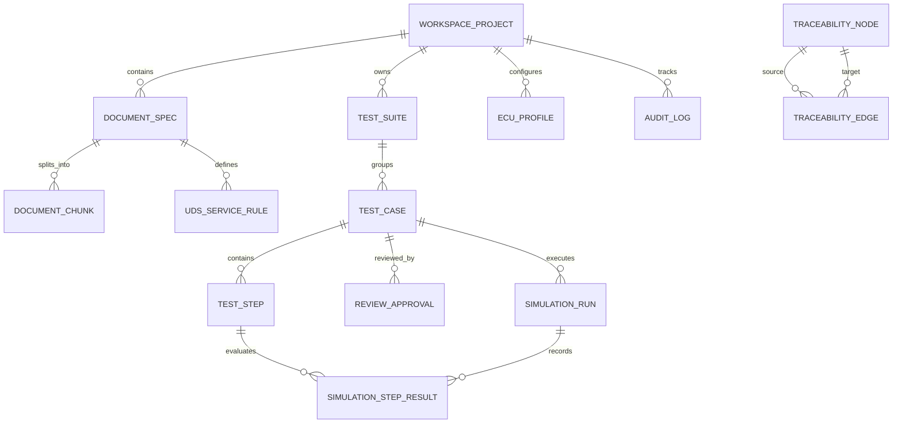
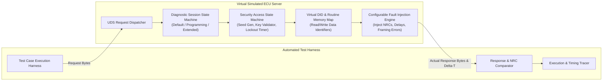
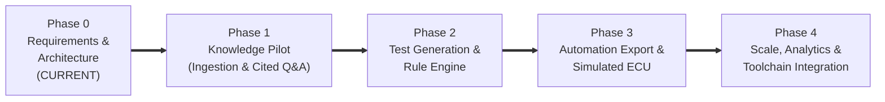

# Proposed System Architecture & Technical Specification
## Project: Rule-Verified AI Assistant for UDS Diagnostic Test Generation and Validation
**Company Reference:** Tata Technologies — Automotive Engineering AI | Project Case Studies (pp. 20–25)  
**Document Status:** Baseline Architecture for Phase 0  
**Classification:** Confidential / Tata Technologies Standard  

---

## 1. Architectural Vision, Governance & Boundary Alignment

### 1.1 Context and Problem Statement
Automotive electronic control unit (ECU) diagnostics testing is governed by the Unified Diagnostic Services (UDS) standard (ISO 14229-1), supported by ISO 14229-2 (session layer), ISO 15765-2 (DoCAN), and ISO 13400 (DoIP), layered with highly proprietary OEM diagnostic specifications and variant-specific ECU diagnostic extracts (ODX/CDD/ARXML).

Diagnostic test engineers face significant challenges:
- Manual interpretation of hundreds of pages of overlapping standards and OEM amendments.
- Error-prone request-message construction (Service IDs, subfunctions, suppress-positive-response bits, parameter byte offsets, padding).
- Complex session management (Default, Extended, Programming) and security access prerequisites (Seed-Key algorithms, security levels, lockout timers).
- High overhead in authoring complementary negative test cases (covering all applicable Negative Response Codes - NRCs).
- High manual effort translating test specifications into automation scripts (Python, Vector CANoe / CAPL).

### 1.2 Core Architectural Principle: Rule-Verified AI
Generative Large Language Models (LLMs) excel at natural language synthesis, technical document retrieval, and template authoring, but are probabilistic and susceptible to hallucinations in low-level byte fields. Conversely, automotive diagnostics requires $100\%$ deterministic compliance.

The system solves this via a **Dual-Engine Architecture**:
1. **AI Generation Engine:** Synthesizes context from ingested diagnostic specifications to draft structured test cases and automation scripts.
2. **Deterministic UDS Rule Engine:** Intercepts every AI output and executes strict, deterministic validation against formal ISO 14229 protocol schemas, session state transition matrices, and parameter byte rules.
3. **Mandatory Human-in-the-Loop (HITL) Gate:** Requires authorized engineering specialists to inspect, edit, and formally approve test artifacts before execution or export.
4. **Sandboxed Simulated ECU Runtime:** Executes tests safely against an in-memory virtual ECU, preventing any risk of unmonitored execution on physical production vehicles.

```
+---------------------------------------------------------------------------------------------------+
|                                  CORE GOVERNANCE PRINCIPLE                                        |
|  "AI-generated content must be traceable to approved source material and reviewed by authorized  |
|  engineering specialists before it is used for compliance, design approval, software release,    |
|  or vehicle validation."                                                                          |
|  — Tata Technologies Reference Solution Document, Section 13 (Page 23)                            |
+---------------------------------------------------------------------------------------------------+
```

---

## 2. Logical Architecture & System Overview

The system architecture follows the **Tata Technologies Common Reference Solution Architecture** (pp. 24–25), organized into four distinct tiers:
1. **Presentation Tier:** Engineering Web UI built with Streamlit.
2. **Application & API Services Tier:** FastAPI backend handling auth, validation, workflow orchestration, and audit.
3. **Intelligence & Verification Tier:** AI Orchestration, Local LLM Inference, Embeddings, and the Deterministic Protocol Rule Engine.
4. **Storage & Execution Tier:** Local Vector Store (ChromaDB), Structured Database (SQLite/PostgreSQL), Graph Traceability Store, Document Ingestion, and Virtual Simulated ECU.



---

## 3. Required Modules Identification (Item 5)

The architecture is decomposed into nine modular, loosely coupled components with strict interface contracts:

```
src/
├── core/
│   ├── ingestion/          # Module 1: Document Ingestion & Specification Parser
│   ├── retrieval/          # Module 2: Local Vector Store & Semantic Retrieval Engine
│   ├── rules/              # Module 3: Deterministic UDS Protocol Rule & Verification Engine
│   ├── generator/          # Module 4: AI Prompt Orchestration & Test Case Generator
│   ├── governance/         # Module 5: Human-in-the-Loop Review, Approval & Audit Manager
│   ├── exporter/           # Module 6: Automation Script Exporter (Python & CAPL)
│   └── simulator/          # Module 7: Virtual Simulated ECU Runtime & Test Harness
├── api/
│   └── services/           # Module 8: Application Services & FastAPI Gateway
└── web/
    └── streamlit_app/      # Module 9: Streamlit Engineering User Interface
```

### 3.1 Module Breakdown

#### Module 1: Document Ingestion & Specification Parser (`core.ingestion`)
- **Purpose:** Parse authorized diagnostic specifications, extract structured diagnostic objects, and prepare context-aware text/table chunks.
- **Inputs:** Authorized PDF documents (ISO standards, OEM specs), ODX-D (ASAM MCD-2D XML), AUTOSAR ARXML diagnostic extracts, CDD files, CSV/JSON tables.
- **Responsibilities:**
  - Validate file authorization, cryptographic hash, and license compliance (`REQ-SEC-02`).
  - Extract text and structural hierarchy using PyMuPDF (`fitz`).
  - Extract tabular parameters (DIDs, subfunctions, memory addresses, NRC tables) using PDFPlumber.
  - Parse formal diagnostic formats (ODX/ARXML) into strongly-typed diagnostic objects (`UDS_Service`, `DID_Definition`, `DiagnosticSession`, `SecurityLevel`).
  - Generate chunk metadata: `project_id`, `doc_type` (STANDARD / OEM / ECU), `version`, `section_id`, `page_number`.
- **Outputs:** Ingestion payloads sent to Vector Retrieval (`core.retrieval`) and structured records stored in Structured Storage (`storage.sql`).

#### Module 2: Vector Embedding & Semantic Retrieval Engine (`core.retrieval`)
- **Purpose:** Maintain project-isolated vector collections and retrieve precise evidence with source citations for user queries and test generation.
- **Inputs:** Text/table chunks from Module 1, diagnostic queries, project filter scopes.
- **Responsibilities:**
  - Generate dense vector embeddings locally using BGE (`bge-large-en-v1.5`) or Sentence Transformers.
  - Maintain project-isolated vector collections in ChromaDB (enforcing `REQ-RULE-03` collection separation: standard vs OEM vs ECU).
  - Perform hybrid retrieval (dense semantic search + metadata filtering) with citation metadata.
- **Outputs:** Ranked context chunks with source citations (document title, section, page, exact excerpt).

#### Module 3: Deterministic UDS Protocol Rule Engine (`core.rules`)
- **Purpose:** Provide non-probabilistic, mathematical verification of diagnostic requests, responses, and state sequences against ISO 14229.
- **Inputs:** Diagnostic request templates, generated test steps, ECU state definitions.
- **Responsibilities:**
  - Verify Service Identifier (SID) validity (e.g., 0x10, 0x22, 0x27, 0x2E, 0x31).
  - Verify subfunction byte syntax and parameter payload lengths.
  - Validate Suppress Positive Response Message Indication Bit (`SPRMIB` - bit 7 of subfunction).
  - Check Diagnostic Session requirements (e.g. Service 0x2E requires Extended Session 0x03).
  - Check Security Access requirements (e.g. Service 0x2E requires Security Level 1 Unlocked).
  - Validate Negative Response Code (NRC) syntax: `0x7F <SID> <NRC>`.
  - Validate timing constraints ($P2_{Server\_max}$, $P2^*_{Server\_max}$).
- **Outputs:** Deterministic validation verdict (`PASS` / `FAIL`), violation error codes, and corrective hints.

#### Module 4: AI Prompt Orchestration & Test Case Generator (`core.generator`)
- **Purpose:** Assemble controlled prompts, invoke the locally hosted approved LLM, and synthesize comprehensive positive and negative test cases.
- **Inputs:** Ingested specification context, user test intent / requirement description, service scope.
- **Responsibilities:**
  - Format structured system prompts enforcing strict JSON schema output.
  - Direct the locally hosted approved LLM (Llama, Mistral, Qwen, DeepSeek, Falcon, or equivalent — specific model & runtime PENDING APPROVAL) to generate structured test scenarios.
  - Automatically synthesize negative test cases (subfunction not supported, invalid length, security locked, session invalid, out-of-range parameters).
  - Pipe generated test draft immediately into Module 3 (`core.rules`) for validation before surfacing to the engineer.
- **Outputs:** Structured test case drafts with preconditions, byte sequences, expected responses, and rule verification results.

#### Module 5: Human-in-the-Loop Review, Approval & Audit Manager (`core.governance`)
- **Purpose:** Enforce the company governance principle: mandatory expert human sign-off prior to test release or execution.
- **Inputs:** Validated test case drafts, engineer review decisions (Accept, Edit, Reject), engineer review notes.
- **Responsibilities:**
  - Maintain lifecycle state machine: `DRAFT` $\rightarrow$ `RULE_VERIFIED` $\rightarrow$ `PENDING_REVIEW` $\rightarrow$ `APPROVED` (or `REJECTED` / `EDITED`).
  - Record immutable audit trail (`audit_logs`) including user identity, timestamp, full prompt, LLM output, rule verification log, and diff of any manual edits.
  - Update cross-artifact traceability graph (Requirement $\rightarrow$ Spec Section $\rightarrow$ Rule $\rightarrow$ Test Case $\rightarrow$ Reviewer).
- **Outputs:** Approved test specifications, immutable compliance audit records.

#### Module 6: Automation Script Exporter (`core.exporter`)
- **Purpose:** Convert approved, rule-verified test cases into production-grade executable scripts for standard test tools.
- **Inputs:** Approved test cases (`review_status = APPROVED`).
- **Responsibilities:**
  - Generate Python automation scripts using `python-can` and `udsoncan` with automated session setup, security seed-key handling, and assertions.
  - Generate Vector CANoe test modules (`.can` / CAPL scripts) with `testfunction`, `testWaitMessage`, and verdict reporting.
  - Export test catalogs to JSON and CSV formats for test management tool ingestion.
- **Outputs:** Standalone, syntax-verified script files ready for test bench execution.

#### Module 7: Virtual Simulated ECU Runtime & Test Harness (`core.simulator`)
- **Purpose:** Provide a safe, deterministic, non-production test execution target in an approved test environment with safeguards (Section 12, Page 22) conforming to the out-of-scope rule prohibiting unmonitored production vehicle execution.
- **Inputs:** Approved test cases, virtual ECU configuration profiles (DIDs, sessions, security keys, supported services).
- **Responsibilities:**
  - Maintain runtime diagnostic state: active session, security lock status, seed generation, routine states, virtual DID memory map.
  - Support execution interfaces (candidate options: in-process direct API vs virtual CAN socket — PENDING APPROVAL).
  - Simulate positive responses (PRPR) and negative responses (NRCs) with timing simulation ($P2$, $P2^*$, and NRC 0x78 Response Pending).
  - Configurable fault injection (simulate invalid response lengths, unexpected NRCs, communication drops).
  - Compare actual ECU response against expected response and generate detailed execution pass/fail reports.
- **Outputs:** Execution logs, byte traces, timing metrics, pass/fail verification verdicts.

#### Module 8: Application Services & FastAPI Gateway (`api.services`)
- **Purpose:** Expose RESTful endpoints, enforce authentication, workspace isolation, and coordinate asynchronous background jobs.
- **Inputs:** Client HTTP requests from Streamlit UI or external automation systems.
- **Responsibilities:**
  - Enforce RBAC and project workspace boundaries (`project_id`).
  - Provide OpenAPI 3.0 documented endpoints for ingestion, semantic Q&A, test generation, rule checking, review workflows, script export, and simulation runs.
- **Outputs:** JSON REST responses, streaming server-sent events for long-running LLM generation.

#### Module 9: Streamlit Engineering User Interface (`web.streamlit_app`)
- **Purpose:** Provide an intuitive, engineer-friendly web application for diagnostic test engineers, validation leads, and quality managers.
- **Inputs:** User clicks, diagnostic queries, file uploads, approval actions.
- **Responsibilities:**
  - Workspace selector & Document Ingestion Explorer.
  - Diagnostic Cited Q&A Workspace with expandable source citation drawers.
  - Test Generation & Rule Verification Studio with side-by-side byte inspector and rule badges.
  - HITL Review Board for formal engineer sign-off and rejection workflows.
  - Simulated ECU Test Runner with live CAN trace log and timing visualizer.
- **Outputs:** Interactive browser interface rendered purely via Streamlit.

---

## 4. End-to-End Processing Flows & Sequence Workflows

The reference solution document defines two detailed workflow specifications:
1. **High-Level Workflow (Section 7, Steps 29–35, Page 21)**
2. **Reference Processing Flow (Section Reference Processing Flow, Steps 36–49, Page 25)**

The sequence diagrams below illustrate how the nine modules execute these steps with complete traceability.

### 4.1 Ingestion, Extraction & Project-Isolated Vectorization Flow (Steps 29–31 & 36–41)



### 4.2 Test Generation, Deterministic Rule Verification & Human Review Flow (Steps 32–35 & 42–49)



### 4.3 Safe Simulated-ECU Execution & Response Comparison Flow



---

## 5. Preliminary Database & Data Model (Item 6)

The data model is designed to support the **Tata Technologies Structured Store** requirement (SQLite for pilot, migrating to PostgreSQL for production) and the **Graph / Traceability Store** requirement (cross-artifact relationships and audit reports).

### 5.1 Entity-Relationship (ER) Diagram



### 5.2 Structured Database Schema Definitions (SQL DDL)

#### Table 1: `workspaces_projects` (Multi-Project Isolation Boundary)
```sql
CREATE TABLE workspaces_projects (
    project_id VARCHAR(64) PRIMARY KEY,
    name VARCHAR(255) NOT NULL,
    description TEXT,
    oem_name VARCHAR(128) NOT NULL,
    ecu_model VARCHAR(128) NOT NULL,
    created_at TIMESTAMP DEFAULT CURRENT_TIMESTAMP,
    updated_at TIMESTAMP DEFAULT CURRENT_TIMESTAMP,
    is_active BOOLEAN DEFAULT TRUE
);
```

#### Table 2: `documents_specs` (Ingested Specifications & Provenance)
```sql
CREATE TABLE documents_specs (
    doc_id VARCHAR(64) PRIMARY KEY,
    project_id VARCHAR(64) NOT NULL REFERENCES workspaces_projects(project_id) ON DELETE CASCADE,
    filename VARCHAR(255) NOT NULL,
    doc_type VARCHAR(32) NOT NULL, -- 'STANDARD_ISO', 'OEM_SPEC', 'ECU_EXTRACT', 'REQUIREMENTS'
    file_format VARCHAR(16) NOT NULL, -- 'PDF', 'ODX_D', 'ARXML', 'CDD', 'CSV', 'JSON'
    file_hash_sha256 VARCHAR(64) NOT NULL,
    version VARCHAR(32),
    authorization_status VARCHAR(32) DEFAULT 'AUTHORIZED', -- 'AUTHORIZED', 'PENDING', 'REVOKED'
    ingested_at TIMESTAMP DEFAULT CURRENT_TIMESTAMP,
    ingested_by VARCHAR(128) NOT NULL,
    total_pages_or_records INTEGER DEFAULT 0
);
```

#### Table 3: `document_chunks` (Embeddings & Semantic Retrieval Citations)
```sql
CREATE TABLE document_chunks (
    chunk_id VARCHAR(64) PRIMARY KEY,
    doc_id VARCHAR(64) NOT NULL REFERENCES documents_specs(doc_id) ON DELETE CASCADE,
    project_id VARCHAR(64) NOT NULL REFERENCES workspaces_projects(project_id) ON DELETE CASCADE,
    section_title VARCHAR(255),
    page_number INTEGER,
    content TEXT NOT NULL,
    token_count INTEGER,
    vector_id VARCHAR(128), -- Reference ID in ChromaDB collection
    created_at TIMESTAMP DEFAULT CURRENT_TIMESTAMP
);
CREATE INDEX idx_chunks_project ON document_chunks(project_id);
CREATE INDEX idx_chunks_doc ON document_chunks(doc_id);
```

#### Table 4: `uds_service_rules` (Deterministic ISO 14229 Protocol Ground Truth)
```sql
CREATE TABLE uds_service_rules (
    rule_id VARCHAR(64) PRIMARY KEY,
    project_id VARCHAR(64) REFERENCES workspaces_projects(project_id) ON DELETE CASCADE,
    service_id INTEGER NOT NULL, -- Hex SID, e.g. 0x22 (34)
    service_name VARCHAR(64) NOT NULL, -- e.g. 'ReadDataByIdentifier'
    subfunction INTEGER, -- NULL if service does not support subfunctions
    subfunction_name VARCHAR(64),
    requires_subfunction BOOLEAN DEFAULT FALSE,
    supports_suppress_pos_bit BOOLEAN DEFAULT FALSE,
    min_request_length INTEGER NOT NULL,
    max_request_length INTEGER,
    allowed_sessions VARCHAR(128) NOT NULL DEFAULT 'DEFAULT,EXTENDED,PROGRAMMING',
    required_security_level INTEGER DEFAULT 0, -- 0 = Locked/No Security, 1 = Level 1, etc.
    standard_nrcs VARCHAR(255), -- Comma-separated list: '0x11,0x12,0x13,0x22,0x31,0x33'
    is_oem_override BOOLEAN DEFAULT FALSE
);
CREATE INDEX idx_rules_sid ON uds_service_rules(service_id, subfunction);
```

#### Table 5: `test_suites` and `test_cases` (Generated Diagnostic Test Artifacts)
```sql
CREATE TABLE test_suites (
    suite_id VARCHAR(64) PRIMARY KEY,
    project_id VARCHAR(64) NOT NULL REFERENCES workspaces_projects(project_id) ON DELETE CASCADE,
    name VARCHAR(255) NOT NULL,
    description TEXT,
    service_id INTEGER,
    created_at TIMESTAMP DEFAULT CURRENT_TIMESTAMP,
    created_by VARCHAR(128) NOT NULL
);

CREATE TABLE test_cases (
    test_case_id VARCHAR(64) PRIMARY KEY,
    suite_id VARCHAR(64) NOT NULL REFERENCES test_suites(suite_id) ON DELETE CASCADE,
    project_id VARCHAR(64) NOT NULL REFERENCES workspaces_projects(project_id) ON DELETE CASCADE,
    case_number VARCHAR(32) NOT NULL, -- e.g. 'TC_UDS_0x22_001_POS'
    title VARCHAR(255) NOT NULL,
    description TEXT,
    test_type VARCHAR(32) NOT NULL, -- 'POSITIVE', 'NEGATIVE_NRC', 'SESSION_BOUNDARY', 'SECURITY_LOCKOUT'
    preconditions JSON NOT NULL, -- e.g. {"session": "0x03", "security": 1}
    pass_fail_criteria TEXT NOT NULL,
    rule_verification_status VARCHAR(32) NOT NULL, -- 'PASSED', 'FAILED_RULE_VIOLATION'
    rule_verification_details JSON,
    review_status VARCHAR(32) NOT NULL DEFAULT 'PENDING_REVIEW', -- 'PENDING_REVIEW', 'APPROVED', 'EDITED', 'REJECTED'
    citation_references JSON, -- Array of {doc_id, section, page, chunk_id}
    created_at TIMESTAMP DEFAULT CURRENT_TIMESTAMP,
    updated_at TIMESTAMP DEFAULT CURRENT_TIMESTAMP
);
CREATE INDEX idx_testcases_review ON test_cases(review_status);
CREATE INDEX idx_testcases_project ON test_cases(project_id);
```

#### Table 6: `test_steps` (Atomic Diagnostic Request-Response Steps)
```sql
CREATE TABLE test_steps (
    step_id VARCHAR(64) PRIMARY KEY,
    test_case_id VARCHAR(64) NOT NULL REFERENCES test_cases(test_case_id) ON DELETE CASCADE,
    step_number INTEGER NOT NULL,
    step_description VARCHAR(255),
    request_hex VARCHAR(512) NOT NULL, -- Hex byte string, e.g. '22 F1 90'
    expected_response_type VARCHAR(16) NOT NULL, -- 'POSITIVE', 'NEGATIVE'
    expected_response_hex VARCHAR(512), -- Expected PRPR hex or pattern
    expected_nrc VARCHAR(8), -- e.g. '0x22' if NEGATIVE
    timeout_ms INTEGER DEFAULT 2000, -- P2Server_max
    suppress_pos_rsp BOOLEAN DEFAULT FALSE
);
CREATE INDEX idx_steps_testcase ON test_steps(test_case_id, step_number);
```

#### Table 7: `reviews_approvals` (Human-in-the-Loop Expert Governance)
```sql
CREATE TABLE reviews_approvals (
    approval_id VARCHAR(64) PRIMARY KEY,
    test_case_id VARCHAR(64) NOT NULL REFERENCES test_cases(test_case_id) ON DELETE CASCADE,
    reviewer_name VARCHAR(128) NOT NULL,
    reviewer_role VARCHAR(64) NOT NULL, -- 'DIAGNOSTIC_ENGINEER', 'VALIDATION_LEAD', 'QUALITY_MANAGER'
    action VARCHAR(32) NOT NULL, -- 'APPROVED', 'EDITED_AND_APPROVED', 'REJECTED'
    review_comments TEXT,
    original_content_snapshot JSON, -- Immutable snapshot of content before any edits
    approved_content_snapshot JSON, -- Final approved content
    timestamp TIMESTAMP DEFAULT CURRENT_TIMESTAMP
);
CREATE INDEX idx_approvals_testcase ON reviews_approvals(test_case_id);
```

#### Table 8: `audit_logs` (Immutable Regulatory & Compliance Audit Trail)
```sql
CREATE TABLE audit_logs (
    audit_id VARCHAR(64) PRIMARY KEY,
    project_id VARCHAR(64) NOT NULL REFERENCES workspaces_projects(project_id) ON DELETE CASCADE,
    event_type VARCHAR(64) NOT NULL, -- 'DOCUMENT_INGESTED', 'QUERY_SUBMITTED', 'TEST_GENERATED', 'RULE_VERIFIED', 'HUMAN_APPROVAL', 'SIMULATION_EXECUTED', 'SCRIPT_EXPORTED'
    performed_by VARCHAR(128) NOT NULL,
    details JSON NOT NULL, -- Full payload, prompt, response, rule violations, or diff
    ip_address VARCHAR(45),
    created_at TIMESTAMP DEFAULT CURRENT_TIMESTAMP
);
CREATE INDEX idx_audit_project_event ON audit_logs(project_id, event_type);
```

#### Table 9: `simulation_runs` and `simulation_step_results` (Virtual ECU Execution)
```sql
CREATE TABLE simulation_runs (
    run_id VARCHAR(64) PRIMARY KEY,
    project_id VARCHAR(64) NOT NULL REFERENCES workspaces_projects(project_id) ON DELETE CASCADE,
    test_case_id VARCHAR(64) NOT NULL REFERENCES test_cases(test_case_id),
    ecu_profile_id VARCHAR(64) NOT NULL,
    verdict VARCHAR(32) NOT NULL, -- 'PASS', 'FAIL', 'ERROR', 'TIMEOUT'
    executed_by VARCHAR(128) NOT NULL,
    started_at TIMESTAMP DEFAULT CURRENT_TIMESTAMP,
    completed_at TIMESTAMP,
    total_steps INTEGER,
    passed_steps INTEGER,
    failed_steps INTEGER
);

CREATE TABLE simulation_step_results (
    result_id VARCHAR(64) PRIMARY KEY,
    run_id VARCHAR(64) NOT NULL REFERENCES simulation_runs(run_id) ON DELETE CASCADE,
    step_id VARCHAR(64) NOT NULL REFERENCES test_steps(step_id),
    actual_request_hex VARCHAR(512) NOT NULL,
    actual_response_hex VARCHAR(512),
    actual_nrc VARCHAR(8),
    response_time_ms INTEGER NOT NULL,
    step_verdict VARCHAR(16) NOT NULL, -- 'PASS', 'FAIL', 'TIMEOUT'
    byte_diff_details TEXT
);
```

#### Table 10: Graph Traceability Store Schema (`traceability_nodes` & `traceability_edges`)
To support cross-artifact traceability (Flow Step 49) without requiring external graph infrastructure during the pilot:
```sql
CREATE TABLE traceability_nodes (
    node_id VARCHAR(64) PRIMARY KEY, -- e.g. 'REQ_001', 'CHUNK_42', 'RULE_0x22', 'TC_001', 'APPROVAL_12'
    node_type VARCHAR(32) NOT NULL, -- 'REQUIREMENT', 'DOC_CHUNK', 'UDS_RULE', 'TEST_CASE', 'APPROVAL', 'SIM_RUN'
    label VARCHAR(255) NOT NULL,
    metadata JSON
);

CREATE TABLE traceability_edges (
    edge_id VARCHAR(64) PRIMARY KEY,
    source_node_id VARCHAR(64) NOT NULL REFERENCES traceability_nodes(node_id) ON DELETE CASCADE,
    target_node_id VARCHAR(64) NOT NULL REFERENCES traceability_nodes(node_id) ON DELETE CASCADE,
    relationship_type VARCHAR(64) NOT NULL, -- 'DERIVED_FROM', 'VERIFIED_BY', 'APPROVED_BY', 'VALIDATED_IN'
    created_at TIMESTAMP DEFAULT CURRENT_TIMESTAMP
);
CREATE INDEX idx_edges_source ON traceability_edges(source_node_id);
CREATE INDEX idx_edges_target ON traceability_edges(target_node_id);
```

---

## 6. UDS Protocol Scope Definition (Item 7)

The UDS scope aligns directly with the functional capabilities specified in the Reference Solution Document (Section 6, Page 21: *Service, subfunction, DID, RID, NRC, session, and security guidance*).

### 6.1 UDS Functional Service Matrix (ISO 14229-1)

The assistant supports all primary diagnostic service categories with comprehensive positive and negative validation:

| SID | Service Name | ISO Standard Function & Subfunctions | Required Preconditions | Supported Negative Response Codes (NRCs) |
| :---: | :--- | :--- | :--- | :--- |
| **0x10** | **Diagnostic Session Control** | 0x01: Default Session<br>0x02: Programming Session<br>0x03: Extended Diagnostic Session<br>0x04: Safety System Session | Default available at boot.<br>Programming requires seed-key or pre-conditions. | `0x12`: SubfunctionNotSupported<br>`0x13`: IncorrectMessageLength<br>`0x22`: ConditionsNotCorrect |
| **0x11** | **ECU Reset** | 0x01: Hard Reset<br>0x02: Key Off/On Reset<br>0x03: Soft Reset<br>0x04: Enable Rapid Power Shutdown<br>0x05: Disable Rapid Power Shutdown | Typically requires Extended or Programming Session. | `0x12`: SubfunctionNotSupported<br>`0x13`: IncorrectMessageLength<br>`0x22`: ConditionsNotCorrect<br>`0x33`: SecurityAccessDenied |
| **0x14** | **Clear Diagnostic Information** | Parameters: 3-byte DTC Group Mask (e.g., `0xFFFFFF` for all DTCs). | Extended session recommended. Vehicle speed $= 0$. | `0x13`: IncorrectMessageLength<br>`0x22`: ConditionsNotCorrect<br>`0x31`: RequestOutOfRange |
| **0x19** | **Read DTC Information** | 0x01: reportNumberOfDTCByStatusMask<br>0x02: reportDTCByStatusMask<br>0x04: reportDTCSnapshotRecordByDTCNumber<br>0x06: reportDTCExtendedDataRecordByDTCNumber | Allowed in Default and Extended sessions. | `0x12`: SubfunctionNotSupported<br>`0x13`: IncorrectMessageLength<br>`0x31`: RequestOutOfRange |
| **0x22** | **Read Data By Identifier** | Parameters: One or more 2-byte Data Identifiers (DIDs), e.g. `0xF190` (VIN), `0xF189` (ECU Software Number). | Usually allowed in Default & Extended. Proprietary DIDs may require Security Access. | `0x13`: IncorrectMessageLength<br>`0x22`: ConditionsNotCorrect<br>`0x31`: RequestOutOfRange (DID not supported)<br>`0x33`: SecurityAccessDenied |
| **0x27** | **Security Access** | 0x01/0x03/0x05: Request Seed<br>0x02/0x04/0x06: Send Key | Extended or Programming Session. Requires prior RequestSeed step before SendKey. | `0x12`: SubfunctionNotSupported<br>`0x13`: IncorrectMessageLength<br>`0x24`: RequestSequenceError<br>`0x35`: InvalidKey<br>`0x36`: ExceededNumberOfAttempts<br>`0x37`: RequiredTimeDelayNotExpired |
| **0x28** | **Communication Control** | Subfunctions: 0x00 (enableRxAndTx), 0x01 (enableRxAndDisableTx), 0x03 (disableRxAndTx). Communication Types: Normal, NM. | Extended Session. | `0x12`: SubfunctionNotSupported<br>`0x13`: IncorrectMessageLength<br>`0x22`: ConditionsNotCorrect<br>`0x31`: RequestOutOfRange |
| **0x2E** | **Write Data By Identifier** | Parameters: 2-byte DID + Data Payload to write (e.g. calibration offsets, configuration flags). | Extended Session + Security Access Unlocked (Level 1/2). | `0x13`: IncorrectMessageLength<br>`0x22`: ConditionsNotCorrect<br>`0x31`: RequestOutOfRange<br>`0x33`: SecurityAccessDenied |
| **0x2F** | **InputOutput Control By Identifier** | Control Option: ReturnControlToECU (0x00), ResetToDefault (0x01), FreezeCurrentState (0x02), ShortTermAdjustment (0x03). | Extended Session + Security Access. Engine off. | `0x13`: IncorrectMessageLength<br>`0x22`: ConditionsNotCorrect<br>`0x31`: RequestOutOfRange<br>`0x33`: SecurityAccessDenied |
| **0x31** | **Routine Control** | 0x01: Start Routine<br>0x02: Stop Routine<br>0x03: Request Routine Results<br>Parameters: 2-byte RID + Routine Control Option Record. | Extended or Programming Session + Security Access. | `0x12`: SubfunctionNotSupported<br>`0x13`: IncorrectMessageLength<br>`0x22`: ConditionsNotCorrect<br>`0x24`: RequestSequenceError<br>`0x31`: RequestOutOfRange<br>`0x33`: SecurityAccessDenied |
| **0x34** | **Request Download** | DataFormatIdentifier, AddressAndLengthFormatIdentifier, MemoryAddress, MemorySize. | Programming Session + Security Access (Flash programming unlocked). | `0x13`: IncorrectMessageLength<br>`0x22`: ConditionsNotCorrect<br>`0x31`: RequestOutOfRange<br>`0x33`: SecurityAccessDenied |
| **0x36** | **Transfer Data** | BlockSequenceCounter (1 byte) + TransferRequestParameterRecord. | Prior successful RequestDownload (0x34) or RequestUpload (0x35). | `0x24`: RequestSequenceError<br>`0x73`: WrongBlockSequenceCounter<br>`0x71`: TransferDataSuspended |
| **0x37** | **Request Transfer Exit** | Concludes data transfer sequence. | Active 0x36 transfer in progress. | `0x24`: RequestSequenceError<br>`0x13`: IncorrectMessageLength |
| **0x3E** | **Tester Present** | 0x00: Standard response requested<br>0x80: Suppress positive response bit active. | Any session. Keeps non-default session and security access alive ($S3$ timer). | `0x12`: SubfunctionNotSupported<br>`0x13`: IncorrectMessageLength |
| **0x85** | **Control DTC Setting** | 0x01: DTC Setting ON<br>0x02: DTC Setting OFF | Extended Session. | `0x12`: SubfunctionNotSupported<br>`0x13`: IncorrectMessageLength<br>`0x22`: ConditionsNotCorrect |

### 6.2 Negative Response Code (NRC) Comprehensive Hierarchy

The rule engine deterministically models and asserts the complete ISO 14229-1 Negative Response Code space:

```
NRC 0x10: GeneralReject
NRC 0x11: ServiceNotSupported
NRC 0x12: SubFunctionNotSupported
NRC 0x13: IncorrectMessageLengthOrInvalidFormat
NRC 0x14: ResponseTooLong
NRC 0x21: BusyRepeatRequest
NRC 0x22: ConditionsNotCorrect
NRC 0x24: RequestSequenceError
NRC 0x25: NoResponseFromSubnetComponent
NRC 0x26: FailurePreventsExecutionOfRequestedAction
NRC 0x31: RequestOutOfRange
NRC 0x33: SecurityAccessDenied
NRC 0x35: InvalidKey
NRC 0x36: ExceededNumberOfAttempts
NRC 0x37: RequiredTimeDelayNotExpired
NRC 0x70: UploadDownloadNotAccepted
NRC 0x71: TransferDataSuspended
NRC 0x72: GeneralProgrammingFailure
NRC 0x73: WrongBlockSequenceCounter
NRC 0x78: RequestCorrectlyReceived-ResponsePending (Triggers P2* timer extension)
NRC 0x7E: SubFunctionNotSupportedInActiveSession
NRC 0x7F: ServiceNotSupportedInActiveSession
```

### 6.3 Positive and Negative Test Case Generation Matrix

To fulfill `REQ-FNC-05` and Section 6 of the Reference Document, the generator builds complementary positive and negative test cases for every diagnostic service requirement:

| Dimension | Positive Test Case Pattern | Complementary Negative Test Case Patterns |
| :--- | :--- | :--- |
| **Format & Length** | Exact nominal byte length with valid SID and parameters. | 1. Truncated byte payload $\rightarrow$ Expected `NRC 0x13`<br>2. Appended extraneous bytes $\rightarrow$ Expected `NRC 0x13` |
| **Subfunction Range** | In-range supported subfunction (e.g. 0x01, 0x02). | 1. Out-of-range subfunction (e.g. 0x7A) $\rightarrow$ Expected `NRC 0x12` |
| **Session Context** | Sent while in required session (e.g. Extended 0x03). | 1. Sent in Default Session 0x01 $\rightarrow$ Expected `NRC 0x7F` or `0x7E` |
| **Security Gating** | Sent after valid Seed-Key authentication. | 1. Sent without authentication $\rightarrow$ Expected `NRC 0x33`<br>2. Sent with invalid key $\rightarrow$ Expected `NRC 0x35`<br>3. Exceed attempt limit $\rightarrow$ Expected `NRC 0x36` |
| **Data Parameters** | Valid, calibrated DID / RID in specification extract. | 1. Undefined DID (e.g. `0xFFFF`) $\rightarrow$ Expected `NRC 0x31`<br>2. Out-of-bounds write data payload $\rightarrow$ Expected `NRC 0x31` |
| **Sequence Order** | SendKey following RequestSeed. | 1. SendKey without RequestSeed $\rightarrow$ Expected `NRC 0x24`<br>2. TransferData without RequestDownload $\rightarrow$ Expected `NRC 0x24` |
| **Timing & Keepalive**| TesterPresent sent within $S3_{Server}$ interval (e.g. 2000 ms). | 1. TesterPresent withheld $\rightarrow$ Verify ECU resets to Default Session after $S3$ expires. |

---

## 7. Simulated-ECU Strategy (Item 8)

### 7.1 Strategic Purpose & Scope Compliance
The company reference document explicitly defines as **Out of Scope**:
> *"Execution against production vehicles without controls"* (Section 3, Page 20)

Furthermore, Section 12 mandates:
> *"Risk: Unsafe execution sequence $\rightarrow$ Recommended Control: Execute only in approved test environments with safeguards"* (Page 22)

To fulfill these controls with high fidelity, the architecture incorporates a **Stateful In-Memory Virtual Simulated ECU**. The Simulated ECU acts as a non-hazardous, software-in-the-loop diagnostic server adhering strictly to ISO 14229-1 and ISO 15765-2 rules.

### 7.2 Simulated ECU Architectural Model



### 7.3 Candidate Execution Interfaces (Status: PENDING FORMAL USER APPROVAL)
To satisfy the company requirement of executing only in approved test environments with safeguards (Section 12, Page 22), the following execution interface candidates are under evaluation and require formal approval:
1. **Candidate 3A: Direct In-Process Python Interface (`DirectSimulatorClient`):**
   - Headless, microsecond-latency request/response dispatcher.
   - Candidate for CI/CD test automation, rapid regression testing, and local developer workstations.
2. **Candidate 3B: Virtual CAN Bus Interface (`VirtualCanSimulator`):**
   - Transmits diagnostic frames over a standard virtual CAN bus (using `python-can`'s `virtual` bus channel or Linux `vcan0`).
   - Packages UDS requests inside standard ISO 15765-2 multi-frame transport layer (Single Frame, First Frame, Flow Control, Consecutive Frame).
   - Allows external automotive test tools (Vector CANoe, CANalyzer, custom diagnostic clients) to connect to the simulated ECU transparently.

*Note: Neither candidate interface is assumed as an approved company requirement at this stage. Both options remain pending formal user sign-off.*

### 7.4 Diagnostic State Machine Specifications

#### Session State Machine:
- **Default Session (`0x01`):** Active on startup or after ECU Reset (0x11). Standard DIDs and TesterPresent allowed.
- **Extended Session (`0x03`):** Unlocked via `0x10 0x03`. Enables configuration DIDs, routine controls, and security access requests.
- **Programming Session (`0x02`):** Unlocked via `0x10 0x02`. Enables flashing services (0x34, 0x36, 0x37).
- **$S3$ Server Timer:** Monitored continuously. If no diagnostic request or TesterPresent (`0x3E`) is received within $S3_{Server}$ ($5000\text{ ms}$), the ECU automatically drops back to Default Session and locks security.

#### Security Access State Machine:
- **Locked State:** Default state. Write services (0x2E), critical routines (0x31), and flashing (0x34) are prohibited and return `NRC 0x33` (SecurityAccessDenied).
- **Seed Generated State:** Triggered by `0x27 0x01`. Virtual ECU generates a pseudorandom 4-byte seed and sets an internal pending validation flag.
- **Key Validation:** Triggered by `0x27 0x02 <4-byte key>`. Validates key using configured mathematical algorithm ($Key = Seed \oplus Mask$).
- **Anti-Hammering Lockout:** If 3 consecutive incorrect keys are transmitted, the ECU enters lockout state, returning `NRC 0x36` (ExceededNumberOfAttempts) and enforcing a 10-second delay (`NRC 0x37` RequiredTimeDelayNotExpired).

#### Configurable Fault Injection Engine:
For robust test verification, engineers can configure the Simulated ECU with specific fault injection profiles:
- **Forced NRC Injection:** Force an exact NRC (e.g., `0x22 ConditionsNotCorrect`) on specific service IDs to verify tester handling.
- **Timing Anomaly Injection:** Inject a delayed response ($> P2_{Server\_max}$) or trigger NRC `0x78` (RequestCorrectlyReceived-ResponsePending) to verify tester timing compliance.
- **Message Corruption:** Inject truncated or malformed response frames to verify tester robustness.

---

## 8. Implementation Roadmap for Future Phases (Item 9)

The roadmap aligns the four phases from the **Tata Technologies Implementation Approach** (Section 13, Page 23) and **Recommended Delivery Roadmap** (Stage 3 UDS, Page 25) into actionable technical milestones:



### Phase-by-Phase Milestone Breakdown

#### Phase 0: Requirements & Architecture (Current Phase)
- **Focus:** Analyze company requirements, establish bidirectional traceability, design system architecture, create technology matrix, define UDS protocol scope, define simulated ECU strategy, create risk register.
- **Deliverables:**
  - `docs/requirements-traceability.md`
  - `docs/architecture.md`
  - `docs/technology-matrix.md`
- **Gate / Exit Criteria:** Formal approval of Phase 0 architecture and technology selections.

#### Phase 1: Knowledge Pilot (UDS Specification Ingestion & Cited Q&A)
- **Focus (Reference Document Section 13 & Stage 1):** Ingest authorized diagnostic specifications and deliver cited diagnostic Q&A with source attribution.
- **Milestones & Deliverables:**
  - `core.ingestion`: Implement PDF/ODX document extractors (PyMuPDF, PDFPlumber).
  - `core.retrieval`: Implement local embedding service (BGE) and ChromaDB persistent storage.
  - `api.services`: Implement FastAPI ingestion and query endpoints (`POST /documents`, `POST /query`).
  - `web.streamlit_app`: Implement Document Explorer and Cited Q&A Chat UI.
  - Structured storage for project workspaces and document provenance (SQLite).
- **Gate / Exit Criteria:** $\ge 90\%$ citation accuracy on standard ISO 14229 and OEM specification queries; zero cross-project vector leakage.

#### Phase 2: Test Generation & Rule Verification Engine
- **Focus (Reference Document Section 13 & Stage 2):** Add structured test templates and deterministic rule-based message validation.
- **Milestones & Deliverables:**
  - `core.rules`: Implement ISO 14229 protocol rule engine (SID, subfunction, length, suppress-bit, session, security checks).
  - `core.generator`: Implement structured prompt orchestrator for positive and negative test generation.
  - `core.governance`: Implement Human-in-the-Loop review state machine (`PENDING_REVIEW`, `APPROVED`, `EDITED`, `REJECTED`) and immutable audit logger.
  - `web.streamlit_app`: Implement Test Generation Studio with live byte inspector and HITL Review Board.
- **Gate / Exit Criteria:** $100\%$ interception of protocol syntax errors by deterministic rule engine; mandatory human sign-off enforced before export.

#### Phase 3: Automation Export & Simulated ECU Runtime
- **Focus (Reference Document Section 13 & Stage 3):** Export to Python, CANoe/CAPL, and execute tests against safe simulated ECU.
- **Milestones & Deliverables:**
  - `core.exporter`: Implement script generators for Python (`python-can` / `udsoncan`) and Vector CANoe (`.can` / CAPL test modules).
  - `core.simulator`: Implement Stateful Virtual Simulated ECU (Session, Security, DID memory map, fault injection, timing simulation).
  - In-process and Virtual CAN execution harness with byte comparison and pass/fail verdict reporting.
  - `web.streamlit_app`: Simulated ECU Test Runner tab with live CAN trace logs and timing graphs.
- **Gate / Exit Criteria:** Automated execution of generated test suites against simulated ECU with automated pass/fail verification matching expected NRCs.

#### Phase 4: Enterprise Scale, Analytics & Toolchain Integration
- **Focus (Reference Document Section 13 & Stage 4/5):** Multi-project isolation, coverage analytics, toolchain integration, and production hardening.
- **Milestones & Deliverables:**
  - Coverage analytics engine (service coverage, negative branch coverage, session transition coverage).
  - Migration from SQLite to PostgreSQL; integration of Neo4j graph store for cross-artifact enterprise traceability.
  - Full Docker containerization and CI/CD automated regression pipeline.
  - Toolchain integrations (exporting results to Polarion, Jira, Jenkins).
- **Gate / Exit Criteria:** Multi-tenant project isolation verified; full audit readiness report generation.

---

## 9. Risk & Decision Register (Item 10)

### 9.1 Company Reference Risk Register (Direct Mapping to Section 12, Page 22)

| Ref ID | Risk Description (Company Document Page 22) | Severity / Likelihood | Recommended Architectural Control (Company Document Page 22) | Detailed System Implementation |
| :--- | :--- | :---: | :--- | :--- |
| **RSK-01** | **Incorrect diagnostic message generation** | High / Med | Apply deterministic protocol rules and expert review. | Two-stage barrier: 1) Every AI-drafted message is intercepted by `core.rules` and checked against ISO 14229 schemas; 2) Mandatory HITL review gate requires authorized engineer sign-off (`REQ-RULE-01`, `REQ-GOV-01`). |
| **RSK-02** | **Misinterpretation of OEM-specific behavior** | High / Med | Separate standard, OEM, ECU, and project collections. | Multi-tenant vector collection isolation in ChromaDB. Queries prioritize project/OEM collections over general standard collections, preventing cross-OEM contamination (`REQ-DATA-03`, `REQ-RULE-03`). |
| **RSK-03** | **Unsafe execution sequence** | Critical / Low | Execute only in approved test environments with safeguards. | The application has no live production vehicle connection. All automated runs are sandboxed within the virtual Simulated ECU (`core.simulator`) or approved bench hardware (`REQ-SEC-01`, `REQ-ECU-01`). |
| **RSK-04** | **Standards licensing violation** | High / Low | Use authorized source documents and access controls. | Document ingestion gateway requires explicit administrative authorization, file checksum logging, and license provenance tracking (`REQ-SEC-02`). |

### 9.2 Extended Engineering & Technical Risk Register

| Risk ID | Technical Risk Description | Severity / Likelihood | Mitigation Strategy |
| :--- | :--- | :---: | :--- |
| **RSK-05** | **LLM Byte Hallucination:** Probabilistic LLM produces invalid hex bytes for proprietary DIDs or masks. | High / Med | Deterministic Rule Engine validates byte patterns against ingested ODX/CDD diagnostic tables before presenting to user. |
| **RSK-06** | **Hardware Constraints for Local LLM:** Local developer laptops lack high-end GPUs for local 70B inference. | Med / High | Support quantized 8B models (Llama 3 8B Q4/Q8) running efficiently on CPU/standard GPU via Ollama, or connect to an on-premises private GPU server via REST. |
| **RSK-07** | **Timing Drift in Virtual Simulation:** Simulated ECU timing ($P2/P2^*$) does not match real hardware bench behavior. | Med / Med | Virtual ECU uses high-resolution monotonic timestamps (`time.perf_counter_ns`) and configurable response latency profiles. |

### 9.3 Material Architectural Decisions Log

| Decision ID | Architectural Decision | Selected Option | Alternatives Considered | Rationale |
| :--- | :--- | :--- | :--- | :--- |
| **DEC-01** | User Interface Framework | **Streamlit** | Flask Web UI, React | Explicit company requirement; rapid pilot development; native data visualization. |
| **DEC-02** | Application & API Framework | **FastAPI** | Flask, Django | Explicit company preference; async execution; automatic OpenAPI docs; strict Pydantic models. |
| **DEC-03** | Rule Verification Strategy | **Deterministic Rule Engine in Python** | LLM-as-a-judge | ISO 14229 protocol rules must be 100% deterministic, mathematically auditable, and non-probabilistic. |
| **DEC-04** | Execution Sandbox | **Stateful Virtual Simulated ECU** | Direct CAN hardware only | Satisfies safety constraint preventing unmonitored production execution; enables automated regression testing. |
| **DEC-05** | Database Evolution | **SQLite (Pilot) $\rightarrow$ PostgreSQL (Scale)** | Pure PostgreSQL from Day 1 | SQLite provides zero-dependency local pilot setup; SQLAlchemy ORM guarantees seamless PostgreSQL migration. |

---

## 10. Summary of Architectural Decisions & Formal User Approvals

> **FORMAL APPROVAL STATUS:** The following three material architectural decisions have received **FORMAL USER APPROVAL**.  
> The approved options strictly follow the Tata Technologies Reference Solution Document (pp. 20–25) and are recorded below.  
> Note: Component installations (e.g. LLM runtime, graph components) will occur only upon explicit instruction.

### Decision 1 (AD-01): Local LLM Model Family & Host Strategy
- **Company Reference Specification:** *"Any approved LLM: Llama, Mistral, Qwen, DeepSeek, Falcon, or equivalent (Local, on-premises, or private environment)"* (Pages 21, 24).
- **Approved Selection:** **Option 1A — Local Llama 3.1 8B (or Qwen 2.5 7B) via Ollama**, subject to actual hardware feasibility.
- **Approval Date:** 2026-09-30
- **Status:** `APPROVED BY USER (Option 1A)`

### Decision 2 (AD-02): Graph Traceability Engine for Pilot
- **Company Reference Specification:** *"Graph Store: Neo4j or equivalent (Cross-artifact relationships and traceability)"* (Pages 24, 25).
- **Approved Selection:** **Option 2A — SQLite / NetworkX relational graph equivalent** (preserves zero-dependency portable deployment while fulfilling cross-artifact relationship tracking).
- **Approval Date:** 2026-09-30
- **Status:** `APPROVED BY USER (Option 2A)`

### Decision 3 (AD-03): Simulated ECU / Test Environment Execution Interface
- **Company Reference Specification:** *"Execute only in approved test environments with safeguards"* (Page 22) and *"Export to Python, CANoe, CAPL, or approved frameworks"* (Page 20).
- **Approved Selection:** **Option 3C — Maintain the decoupled dual-tier architecture** with the in-process simulated adapter (`SimulatedECUAdapter`) as the default and Virtual CAN (`python-can` virtual bus / `vcan0`) support only where required.
- **Approval Date:** 2026-09-30
- **Status:** `APPROVED BY USER (Option 3C)`

