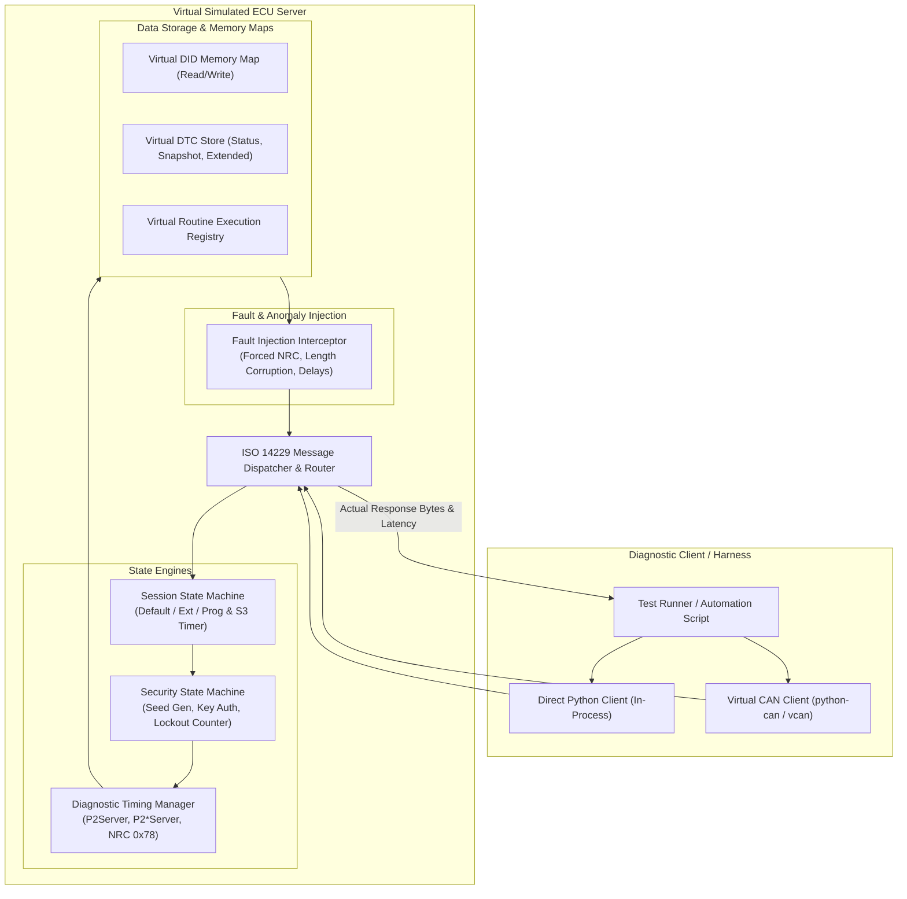
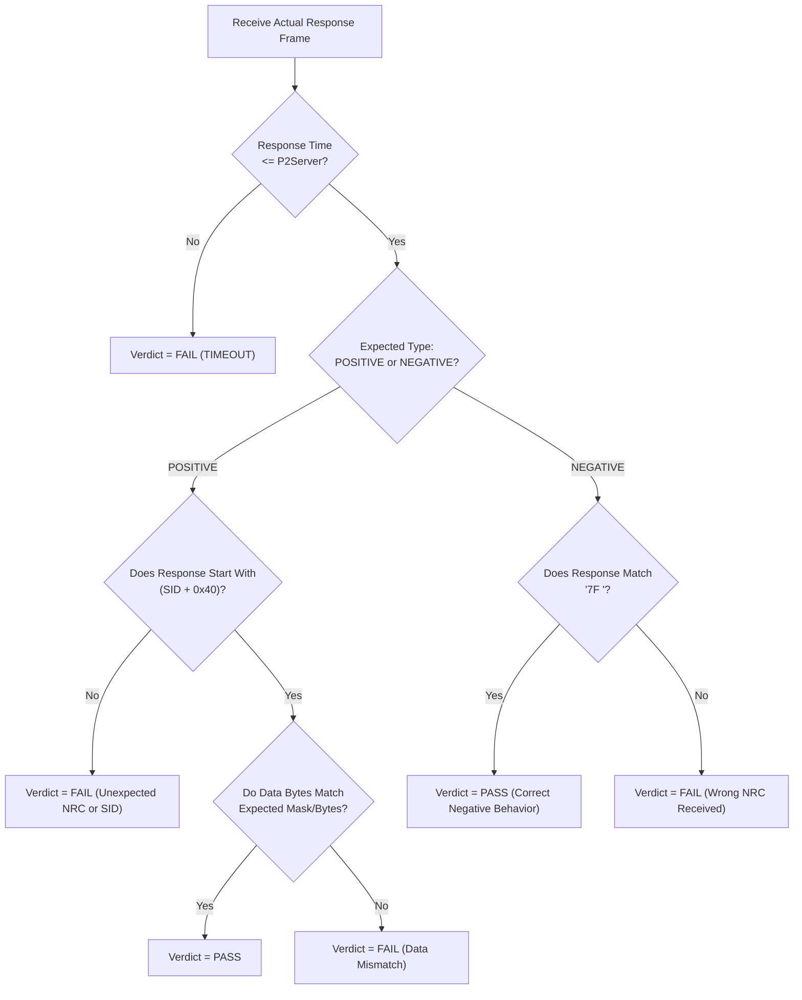

# Simulated-ECU Strategy & Verification Specification
## Project: Rule-Verified AI Assistant for UDS Diagnostic Test Generation and Validation
**Company Reference:** Tata Technologies Case Study 5 (pp. 20–25)  
**Document Status:** Baseline Approved for Phase 0  
**Classification:** Confidential / Tata Technologies Standard  

---

## 1. Executive Purpose & Scope Rationale

### 1.1 Scope Boundary Compliance
The Tata Technologies Reference Solution Document specifies:
- **Out of Scope:** *"Execution against production vehicles without controls"* (Section 3, Page 20).
- **Key Risks & Controls:** *"Unsafe execution sequence $\rightarrow$ Execute only in approved test environments with safeguards"* (Section 12, Page 22).

To guarantee safety, eliminate the risk of vehicle damage, and provide an automated continuous integration test harness, the system incorporates a **Virtual Software-in-the-Loop Simulated ECU**.

### 1.2 Objectives of the Simulated ECU
1. **Safe Non-Hazardous Validation:** Execute generated diagnostic test sequences without requiring a physical ECU or vehicle network.
2. **Deterministic Response Generation:** Accurately simulate ISO 14229-1 server responses, positive response formatting (PRPR), and exact Negative Response Codes (NRCs).
3. **Session & Security State Machine Enforcement:** Emulate stateful transitions across Default (0x01), Programming (0x02), and Extended (0x03) sessions, including seed-key authorization and anti-hammering lockout timers.
4. **Configurable Fault & Timing Injection:** Inject controlled diagnostic anomalies (e.g. response delays, $P2^*$ extensions with NRC 0x78, framing errors, unexpected NRCs) to test client error-handling robustness.
5. **Automated Response Comparison:** Perform byte-by-byte and timing comparison between actual received responses and AI-generated expected responses.

---

## 2. Simulated ECU Architecture & Component Breakdown



---

## 3. Stateful Diagnostic Engines

### 3.1 Diagnostic Session State Machine (ISO 14229-1 / ISO 14229-2)
The Simulated ECU manages the active diagnostic session:
- **Default Session (`0x01`):** Initial power-on state.
  - Allowed services: 0x10, 0x11, 0x22 (standard DIDs), 0x3E.
  - Restricted services: 0x2E (Write DID), 0x27 (Security), 0x31 (Routines), 0x34/0x36 (Flashing).
  - Attempting restricted services returns `NRC 0x7F` (ServiceNotSupportedInActiveSession) or `NRC 0x22` (ConditionsNotCorrect).
- **Extended Diagnostic Session (`0x03`):** Transitioned via `0x10 0x03`.
  - Enables configuration DIDs, security access handshake, routine executions, and DTC clearing.
- **Programming Session (`0x02`):** Transitioned via `0x10 0x02`.
  - Enables software flashing and calibration download services.
- **$S3_{Server}$ Keep-Alive Timer:**
  - Standard value: $5000\text{ ms}$.
  - Every valid diagnostic request or `0x3E` (Tester Present) resets the $S3$ timer.
  - If $S3$ expires without communication, the ECU automatically drops back to Default Session and locks all security levels.

### 3.2 Security Access State Machine (Service 0x27)
- **Locked State (Level 0):** Default state upon boot or session timeout.
- **Request Seed (`0x27 0x01` / `0x03`):**
  - Generates a cryptographically random 4-byte seed (e.g. `0xA1 0xB2 0xC3 0xD4`).
  - Returns `0x67 <subfunction> <4-byte seed>`.
  - Sets security state to `SEED_PENDING`.
  - If seed is requested when already unlocked, returns 4 zero bytes (`0x00 0x00 0x00 0x00`) per ISO 14229.
- **Send Key (`0x27 0x02` / `0x04`):**
  - Validates transmitted key against internal algorithm: $Key = \text{Algorithm}(Seed, \text{SecretMask})$.
  - If valid: Transitions security state to `UNLOCKED_LEVEL_1` (or `LEVEL_2`), resets failed attempt counter, returns `0x67 <subfunction>`.
  - If invalid: Increments failed attempt counter, returns `NRC 0x35` (InvalidKey).
- **Anti-Hammering Lockout:**
  - Maximum failed attempts: $3$.
  - Upon 3rd consecutive failed key, ECU locks out security access, returning `NRC 0x36` (ExceededNumberOfAttempts).
  - Enforces a required lockout delay ($10\text{ seconds}$). Inquiries during lockout return `NRC 0x37` (RequiredTimeDelayNotExpired).

---

## 4. Virtual Memory & Diagnostics Store

### 4.1 Virtual DID Memory Map (Service 0x22 & 0x2E)
The Simulated ECU maintains an in-memory dictionary of standard and OEM DIDs:

| DID | Description | Access Rights | Default Value | Format / Conversion |
| :---: | :--- | :--- | :--- | :--- |
| `0xF186` | Active Diagnostic Session | Read Only (Default/Ext) | `0x01` (Default) | 1-byte session ID |
| `0xF189` | ECU Software Version | Read Only (Default/Ext) | `0x56 0x31 0x2E 0x30` ("V1.0") | 4-byte ASCII |
| `0xF190` | Vehicle Identification Number (VIN) | Read Only (Default/Ext) | "1TATAENG123456789" | 17-byte ASCII |
| `0xF197` | System Name / ECU Title | Read Only (Default/Ext) | "BODY_CTRL_MOD" | 13-byte ASCII |
| `0x2001` | Calibration Offset Angle | Read/Write (Ext + Sec L1) | `0x00 0x64` (+10.0 deg) | 2-byte Signed Big-Endian |
| `0x2002` | Engineering Feature Flag | Read/Write (Ext + Sec L1) | `0x01` (Enabled) | 1-byte Boolean |

- **Read Operations (`0x22`):** Validates session and security permissions; returns `0x62 <DID> <Data>`. Multi-DID requests are supported. If any DID is unknown, returns `NRC 0x31` (RequestOutOfRange).
- **Write Operations (`0x2E`):** Validates length, session, and security. Updates memory map on success and returns `0x6E <DID>`.

### 4.2 Virtual DTC Store (Service 0x14 & 0x19)
- Stores diagnostic trouble codes with status bytes (e.g. `0x09` = confirmedDTC + testFailedSinceLastClear).
- Supports Subfunctions `0x01` (Count DTCs), `0x02` (Read DTCs by mask), `0x04` (Snapshot records), `0x06` (Extended data).
- Service `0x14` (Clear DTCs) clears matching DTC records and resets fault memory.

### 4.3 Virtual Routine Engine (Service 0x31)
- Supports routines such as `0x0201` (Erase Memory), `0x0202` (Calculate Checksum), `0x0301` (Actuator Self-Test).
- Enforces proper execution sequence: `StartRoutine (0x01)` $\rightarrow$ `RequestRoutineResults (0x03)` $\rightarrow$ `StopRoutine (0x02)`. Out-of-order calls return `NRC 0x24` (RequestSequenceError).

---

## 5. Configurable Fault & Timing Injection Engine

To rigorously validate positive and negative test cases, the Simulated ECU includes an active **Fault Injection Interceptor**:

```python
class FaultProfile:
    forced_nrc: Optional[int] = None           # Force exact NRC (e.g. 0x22, 0x33, 0x13)
    response_delay_ms: int = 0                 # Inject latency (e.g. 150 ms)
    inject_response_pending: bool = False      # Emit NRC 0x78 before final response
    corrupt_response_length: bool = False      # Truncate or append junk bytes
    drop_response: bool = False                # Simulate dead ECU (timeout)
```

- **NRC 0x78 (Response Pending) Simulation:** When `inject_response_pending = True`, the simulator immediately transmits `7F <SID> 78`, pauses for a simulated background calculation, and then transmits the final positive or negative response within $P2^*_{Server\_max}$ ($5000\text{ ms}$).

---

## 6. Response Validation & Comparison Engine

The test harness evaluates actual execution results against expected test case templates using the following verification algorithm:



---

## 7. Execution Interface Strategy (Status: PENDING FORMAL USER APPROVAL)

> **CRITICAL DIRECTIVE:** The following interface choices are **PENDING FORMAL USER APPROVAL**.  
> **Do NOT assume DirectSimulatorClient or Virtual CAN as approved company requirements.**  
> The company reference requirements mandate: *"Execute only in approved test environments with safeguards"* (Page 22) and *"Export to Python, CANoe, CAPL, or approved frameworks"* (Page 20).  
> The candidate options below are technical proposals currently under evaluation. Implementation will proceed only upon explicit user approval.

### Candidate Interface Options Under Evaluation:
1. **Candidate 3A (In-Process Python Client - `DirectSimulatorClient`):**
   - Headless, microsecond-latency request/response dispatcher.
   - Evaluated for fast local unit/regression testing without virtual socket configuration.
2. **Candidate 3B (Virtual CAN Socket Interface - `VirtualCanSimulator`):**
   - Emits frames over a virtual CAN channel (`python-can` virtual bus / `vcan0`).
   - Evaluated for interoperability with external tools like Vector CANoe / CAPL.

*Status: Both candidate interfaces remain PENDING FORMAL USER APPROVAL. No implementation will take place without explicit approval.*
